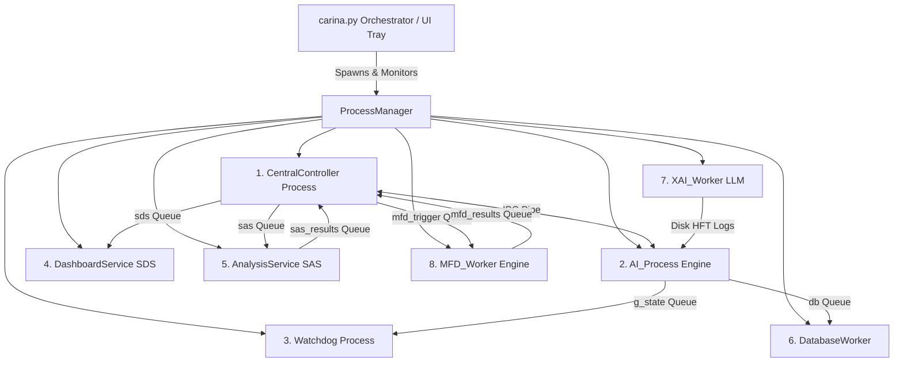
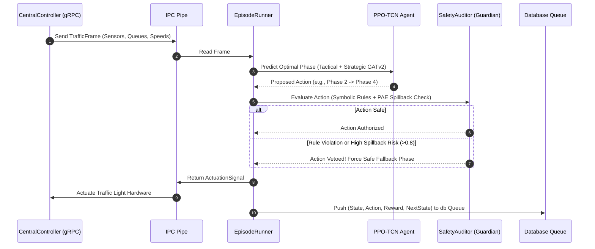

# 🏛️ CARINA: System Blueprint & Multiprocessing Architecture

This document specifies the internal engineering architecture of the CARINA ecosystem. It details the 8 concurrent operating system microservices, the inter-process communication (IPC) topology, the `EpisodeRunner` inference loop, and the neuro-symbolic safety firewall.

⬅️ Back to [Main Documentation Hub](docs/CARINA_MOC.md)

---

## 1. Multiprocessing Microservices Concurrency Model

Python's Global Interpreter Lock (GIL) prevents multi-threaded CPU-bound AI inference and heavy I/O operations from running in true parallelism. To achieve sub-millisecond actuation latency, CARINA employs a **multiprocessing microservice model** orchestrated by `carina.py` and `ProcessManager`.

The system spawns **8 isolated OS processes**, each executing inside its own Python process memory space with its own event loop.



### 1.1 Detailed Microservice Directory & Responsibilities

| Process Name | Entry Target | Key Functionality | Isolation Rationale |
| :--- | :--- | :--- | :--- |
| **`CentralController`** | `run_controller_process()` | Hosts the `Synapse HFT` gRPC server (port 50051) & Prometheus metrics (port 8001). Receives physical traffic frames and returns phase actuation signals. | Keeps hardware I/O non-blocking and isolated from neural training latency. |
| **`AI_Process`** | `run_ai_process()` | Runs `EpisodeRunner`, PPO-TCN inference, GATv2 attention, and the Guardian Safety Firewall. | CPU/GPU intensive neural inference loop; isolated to maintain a fixed 50Hz step frequency. |
| **`Watchdog`** | `run_watchdog()` | Continuously listens to process heartbeats (`wd` queue). Triggers hardware fallback if AI hangs (>500ms). | Real-time safety requirement; must run independently of AI process health. |
| **`DashboardService (SDS)`** | `run_sds_worker()` | Bridges live telemetry from `sds` queue to the desktop UI and WebSocket streams. | Prevents GUI rendering or client network lag from impacting traffic control. |
| **`AnalysisService (SAS)`** | `run_analysis_worker()` | Runs offline SQL queries against historical traffic data to compute infrastructure warrants. | Heavy analytical query execution isolated from production database writes. |
| **`DatabaseWorker`** | `run_database_worker()` | Consumes state/reward tuples from the `db` queue and executes async bulk batch `INSERT` operations (PostgreSQL/SQLite). | Decouples DB disk I/O latency from the real-time control loop. |
| **`XAI_Worker`** | `run_xai_worker()` | Loads `Qwen3 1.7B` LLM and `Captum` Integrated Gradients into GPU memory to generate natural-language explainability reports. | Huge VRAM footprint (1.7B parameters) and multi-second generation time isolated from real-time loop. |
| **`MFD_Worker`** | `run_mfd_worker()` | Computes Macroscopic Fundamental Diagrams (network density vs. space-mean speed & flow) to detect regional gridlock. | Matrix aggregation over large spatial grids isolated from step-by-step PPO decisions. |

---

## 2. Inter-Process Communication (IPC) Channels & Schemas

CARINA uses a hybrid IPC model consisting of high-speed duplex `multiprocessing.Pipe` for real-time control and thread-safe bounded `multiprocessing.Queue` instances for event streaming.

```text
IPC Channel Summary:
├── controller_conn <--> ai_conn (Duplex Pipe): Telemetry frames & Actuation signals (Zero serialization overhead)
├── wd (Queue maxsize=500): Process heartbeats -> Watchdog
├── sds (Queue maxsize=500): Telemetry frames -> DashboardService
├── sas (Queue maxsize=500): Historical metrics -> AnalysisService
├── db (Queue maxsize=500): State/Reward/Action tuples -> DatabaseWorker
├── g_state / g_signal (Queue maxsize=500): Guardian State & Veto Signals
├── sas_results (Queue maxsize=10): Infrastructure Warrants -> CentralController
├── mfd_trigger (Queue maxsize=10): Trigger signal -> MFD_Worker
└── mfd_results (Queue maxsize=10): MFD curves & capacity metrics -> CentralController
```

---

## 3. The `EpisodeRunner` Inference & Safety Pipeline

The `EpisodeRunner` inside `AI_Process` executes at up to 50Hz. Every tick follows a strict multi-layered execution pipeline:



---

## 4. Neuro-Symbolic Safety Architecture

CARINA guarantees **zero catastrophic physical failures** through a two-tiered neuro-symbolic firewall:

1. **Symbolic Guard (Deterministic, 0ms Latency):**
   - Enforces physical hardware rules: *Minimum Green Time* (e.g., 7s), *Yellow Clearance* (3s), *All-Red Interval* (2s), and *Pedestrian Minimum Crossing Time*.
   - Prevents conflicting phases (e.g., green signals on intersecting lanes).

2. **Neural Guard (Predictive PAE + Dueling DQN):**
   - The **Predictive Autoencoder (PAE)** projects temporal queue histories into a low-dimensional latent space $Z$.
   - Predicts **Spillback Risk** (the probability that queue buildup in lane $i$ will block upstream intersection $j$ within the next 30 seconds).
   - If Spillback Risk exceeds threshold $\tau = 0.8$, a **Neural Veto** is fired preemptively to hold green on the clearing avenue.

---

## 5. Single Instance Locking & System Lifecycle

To prevent port conflicts and dual-control race conditions on physical traffic hardware:
- `carina.py` initializes a `SingleInstanceLock` bound to local TCP port `42123`.
- If a user launches a second instance of CARINA, the second process detects port `42123` in use, sends a restore command to bring the existing UI to the foreground, and exits immediately.
- On shutdown, `ProcessManager.shutdown_all()` executes a 10-stage teardown sequence (SIGTERM -> Graceful Join -> SIGKILL fallback -> Process Group cleanup) ensuring zero zombie (`<defunct>`) processes remain.
