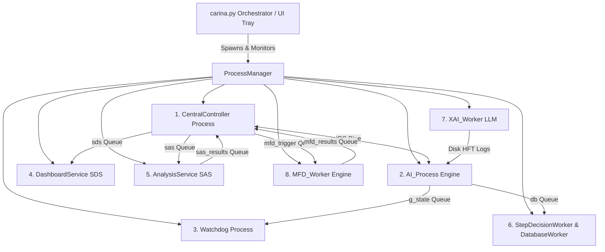

# 🏛️ CARINA: System Blueprint & Multiprocessing Architecture

This document specifies the internal engineering architecture of the CARINA ecosystem. It details the 8 concurrent operating system microservices, the neural network topology, the `TopologicalScaler`, the `ConsultantAgent`, the `CrossAttentionFusion` duality, and the async PostgreSQL delta storage engine.

⬅️ Back to [Main Documentation Hub](docs/CARINA_MOC.md)

---

## 1. Multiprocessing Microservices Concurrency Model

Python's Global Interpreter Lock (GIL) prevents multi-threaded CPU-bound AI inference and heavy I/O operations from running in true parallelism. To achieve sub-millisecond actuation latency, CARINA employs a **multiprocessing microservice model** orchestrated by `carina.py` and `ProcessManager`.



---

## 2. Advanced Deep Learning Architecture

```text
    ┌─────────────────────────────────────────────────────────────────────────┐
    │                        TOPOLOGICAL SCALER (O(1))                        │
    │   Auto-detects Map Nodes (N) -> Latent Dim (32/64/128/256), Heads (2/4/8/16)│
    └────────────────────────────────────┬────────────────────────────────────┘
                                         │
    ┌─────────────────────────┐   ┌──────┴──────────────────┐   ┌───────────────────────────┐
    │     LOCAL AGENT TCN     │   │   ST-GATv2 LITE GRAPH   │   │   GLOBAL CONSULTANT PAE   │
    │ (Edge AI Real-Time 0.5ms)│   │ (Green Wave Coordinator)│   │ (Background Predictive 128ch)│
    └────────────┬────────────┘   └────────────┬────────────┘   └─────────────┬─────────────┘
                 │                             │                              │
                 └──────────────────────┬──────┴──────────────────────────────┘
                                        │
                         ┌──────────────┴──────────────┐
                         │   CROSS-ATTENTION FUSION    │
                         │ Dual Mode:                  │
                         │ - LocalAgent: Adaptive PBT  │
                         │ - Guardian: Fixed Weights   │
                         └──────────────┬──────────────┘
                                        │
                         ┌──────────────┴──────────────┐
                         │  UNIVERSAL AMP & TENSORCORE │
                         │ (torch.amp.autocast FP16)   │
                         └─────────────────────────────┘
```

### 2.1 Módulo ST-GATv2 Lite (`st_gatv2_lite.py`)
- **Proposta:** Sincronização espacial de Onda Verde entre semáforos vizinhos da malha urbana.
- **Dinamismo:** A topologia do grafo viário físico é estática, mas as atenções espaciais $\alpha_{ij}(t)$ são recalculadas em tempo real com base no fluxo.

### 2.2 Agente Consultor Global PAE (`consultant_agent.py`)
- **Proposta:** Rodando em segundo plano acionado por eventos de telemetria, pensa no futuro ($t + \Delta t$) com um Predictive Autoencoder (PAE) de alta capacidade (64 a 128 canais em Londrina).
- **Mentoria Direcionada:** Emite vetores latentes preditivos individualizados por evento para enriquecer a tomada de decisão dos agentes locais.

### 2.3 Auto-Dimensionador Topológico (`topo_scaler.py`)
- **Cálculo Algorítmico em $O(1)$:** Auto-detecta a densidade do mapa ($N$ semáforos) e ajusta autonomamente as dimensões neurais em potências de 2 amigáveis aos NVIDIA TensorCores:
  - $N \le 20 \implies \text{dim} = 32, \text{heads} = 2$
  - $20 < N \le 80 \implies \text{dim} = 64, \text{heads} = 4$
  - $80 < N \le 250 \implies \text{dim} = 128, \text{heads} = 8$ (Ex: Londrina)
  - $N > 250 \implies \text{dim} = 256, \text{heads} = 16$ (Megalópoles)

### 2.4 Dualidade no Cross-Attention (`cross_attention.py`)
- **`LocalAgent` (PPO):** Cross-Attention com **PBT (Population-Based Training)** adaptativo evoluindo a temperatura de Softmax ($\tau$) em tempo real.
- **`GuardianAgent` (D3QN):** Cross-Attention com **Pesos Fixos e Determinísticos** (`is_fixed=True`) para servir como régua inabalável de veto de segurança.

### 2.5 Aceleração Universal AMP (`torch.amp.autocast`)
- Todas as inferências neurais foram envelopadas com `torch.amp.autocast`, ativando aceleração nativa FP16/TF32 nos NVIDIA TensorCores e reduzindo o consumo de VRAM para apenas **~20 MB**.

---

## 3. Persistent Data & Delta Storage Engine

CARINA conta com um motor de persistência assíncrona com **compressão delta** no PostgreSQL:
- **`step_decisions`**: Decisões, vetos e timers gravados via `StepDecisionWorker` em lote assíncrono (< 0,001 ms RAM push).
- **`edge_dictionary`**: Mapeamento de nomes de vias para IDs inteiros de 4 bytes.
- **Redução de Armazenamento:** Economia global de **97,9% no disco do PostgreSQL** (~380 MB/dia para 200 semáforos).
