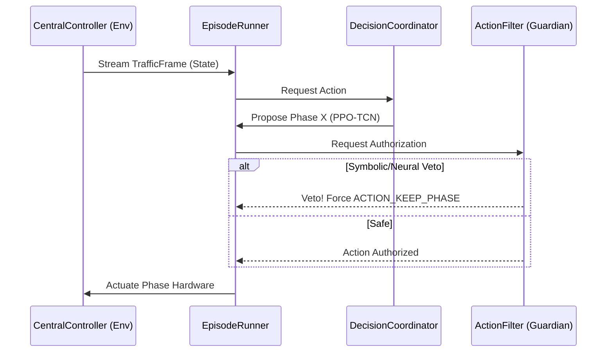

# 🏛️ CARINA: The Complete System Blueprint

This document specifies the exact, low-level boundaries of the CARINA ecosystem. It maps out the asynchronous micro-processes, the neural interaction matrices, and the rigorous pipeline that guarantees fail-safe traffic execution.

⬅️ Back to [[CARINA_MOC|Main Documentation Hub]]

---

## 1. The Multiprocessing Concurrency Engine

At its core, CARINA operates as a distributed system on a single machine. The `carina.py` launcher orchestrates this by spawning 7 isolated operating system processes. This completely negates Python's Global Interpreter Lock (GIL) and prevents heavy I/O or LLM inference from stuttering the real-time AI control loop.

### 1.1 Process Boundaries & IPC Queues
- **`CentralController`**: Hosts the gRPC Server (`HFTLink`). Receives raw telemetry from the physical world. It uses an internal `Pipe` to communicate with the `AI_Process`.
- **`AI_Process`**: Hosts the `EpisodeRunner`. This is the Reinforcement Learning heart. It steps the environment, calculates rewards, and calls neural inference.
- **`DatabaseWorker`**: A dedicated process listening to the `db` Queue. The AI pushes JSON serialized reward states into the queue. The worker executes bulk SQL `INSERT` commands.
- **`Watchdog`**: Monitors the health of all processes via heartbeat mechanisms. If the `AI_Process` hangs, the Watchdog alerts the `CentralController` to instantly revert the physical intersection to a hardcoded safe state.
- **`XAI_Worker`**: Loads the massive Qwen3 1.7B language model into VRAM. It listens for explanation requests, generating heavy text reports entirely detached from the traffic simulation timeline.
- **`DashboardService (SDS)`**: Runs the WebSocket server, streaming live metrics to the UI.
- **`AnalysisService (SAS)`**: Runs offline batch analysis over historical database data to calculate engineering warrants.

---

## 2. The GOMES Macro-Architecture

The **Graph-based Operational Multi-agent Expert System (GOMES)** divides traffic cognition into specialized agents.

### 2.1 The Tactical Layer (PPO-TCN + PAE)
The `LocalAgent` is hyper-focused on its specific intersection. 
- **Temporal Context**: Instead of receiving a snapshot of the current traffic, it receives a `StateHistoryManager` tensor (e.g., the last 8 seconds of occupancy). 
- **Physics Fusion**: The `PredictiveAutoencoder` (PAE) projects these 8 seconds into a latent vector `Z`, predicting whether a traffic jam will spill back into the intersection. This vector `Z` is fused into the PPO actor network, granting the agent an implicit understanding of physical momentum.

### 2.2 The Strategic Layer (GATv2 Lite)
Operated by the `StrategicCoordinator`. 
- **Graph Attention**: It creates a topological graph of all intersections. It calculates attention vectors, allowing a `LocalAgent` to prioritize clearing a massive avenue to synchronize a "Green Wave" with its downstream neighbors.

### 2.3 The Guardian Layer (Neuro-Symbolic "Thinking Mode")
The `GuardianAgent` enforces absolute safety and prevents systemic gridlock via a hybrid approach:
- **Symbolic Layer (Real-Time)**: Evaluates physics-based absolutes (e.g., Minimum Green Time, Yellow Clearance, Ghost Green). If an absolute is violated, a deterministic Veto is fired with zero latency.
- **Neural Layer (Background Thinking)**: The `Dueling DQN-TCN` runs asynchronously in the `GuardianWorker`. It uses the PAE and the **Strategic GATv2 vector** to predict *Spillback Risk* (congestion waves) for all intersections simultaneously. It continuously updates a **Preemptive Veto Map** shared with the main process, allowing the safety firewall to execute neural vetoes instantly without blocking the simulation loop.

---

## 3. The `EpisodeRunner` Inference Pipeline

Inside the `AI_Process`, the `EpisodeRunner` loops at high frequency.

1. **State Observation**: Retrieves the `TrafficFrame` from the `CentralController` Pipe.
2. **Action Proposal**: The `DecisionCoordinator` queries the `LocalAgent` for the next phase.
3. **Safety Firewall (`SafetyAuditor`)**: The action is routed to the Auditor.
   - It performs an instantaneous **Symbolic Audit**.
   - If approved, it cross-references the **Preemptive Veto Map** (continuously generated by the asynchronous `GuardianWorker`). If the background thought process flagged the intersection with a high Spillback Risk (>0.8), a Neural Veto is applied instantly.
   - In parallel, the `EpisodeRunner` streams the latest `augmented_state` (with GATv2 context) to the `GuardianStateQueue` to feed the next cycle of background thinking.
4. **Hardware Actuation**: The authorized phase is transmitted back to the physical controller via gRPC.
5. **Reward & Memory**: The `LearningCoordinator` stores the trajectory in the `ReplayMemory`.
6. **Asynchronous Backpropagation**: Once the memory buffer hits the `update_timestep` threshold, the TCNs undergo backpropagation via the `PPOOptimizer`, completely isolated from the real-time decision timeline.

---

## 4. The DA SILVA Maturation Curriculum

To prevent catastrophic physical accidents during the early stages of neural exploration, the `MaturityManager` enforces the **Dynamic Agent Safety Integrated Learning for Validated Autonomy (DA SILVA)** pipeline:

- **CHILD (Shadow Mode)**: The agent predicts actions but the `ActionFilter` mathematically drops them. Loss is computed via imitation learning against the baseline controller.
- **TEEN (Restricted Autonomy)**: The agent controls the intersection only during low-risk hours (e.g., 01:00 AM - 04:00 AM).
- **ADULT (Full Autonomy)**: The `ChildhoodAnalyzer` continuously evaluates the agent. Only when Policy Entropy stabilizes (`< 0.15`) and the Cumulative Reward consistently beats the baseline, is the agent granted 24/7 full autonomous hardware access.
